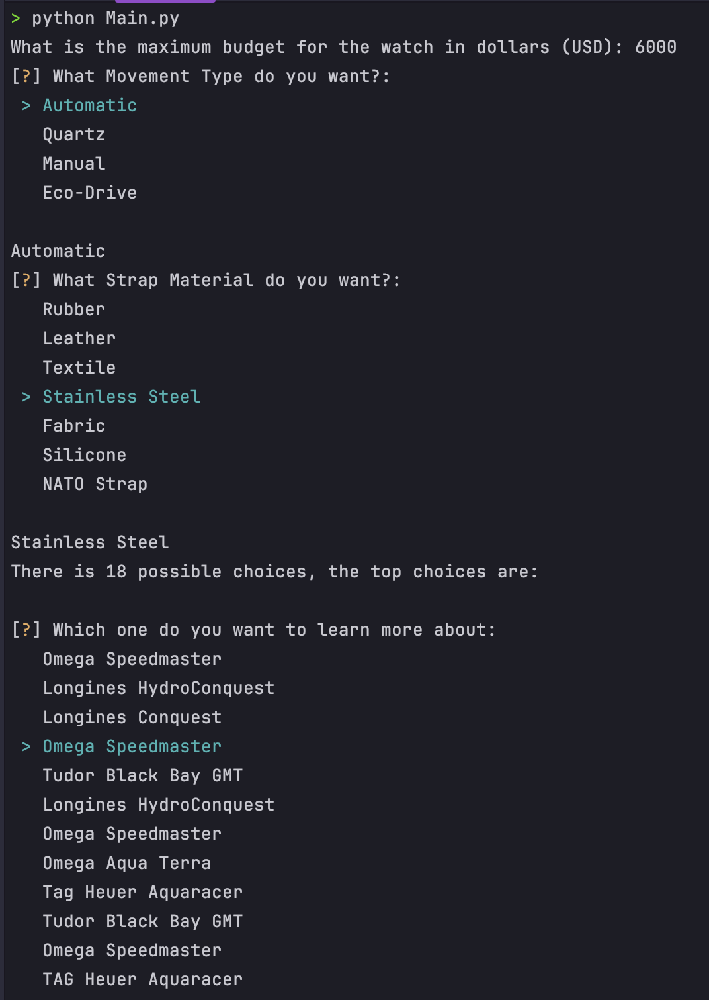

# Luxury Watch Recommendation System
This repository contains a Python-based machine learning recommendation system that suggests luxury watches based on user preferences. The system leverages a combination of content-based and collaborative filtering techniques to provide personalized recommendations for users interested in luxury watches.

## Features
1. **Watch Dataset:** Information about various luxury watches including brands, models, prices, materials, and other attributes.
2. **User Profiles:** Captures user preferences in an elegant way with terminal.
3. **Recommendation Algorithms:** Uses content-based filtering, collaborative filtering, and hybrid recommendation techniques.
4. **Customizable Recommendations:** Users can customize input preferences (price range, brand, style) to get tailored suggestions.
5. **Scalable Architecture:** The system is built to handle additional data, making it scalable as more watches and users are added.

## Installation
1. Clone the repository:
```bash
git clone
```
2. Install the required packages:
```bash
pip install -r requirements.txt
```
3. Run the recommendation system:
```bash
python Main.py
```

## Usage
run the `Main.py` file to start the recommendation system. The system will prompt you to enter your preferences for brand, price range, and style. Based on your input, the system will then recommend a list of luxury watches that match your preferences. You may then select one watch to learn more about it.



## License
This project is licensed under the MIT License - see the [LICENSE](LICENSE) file for details.
